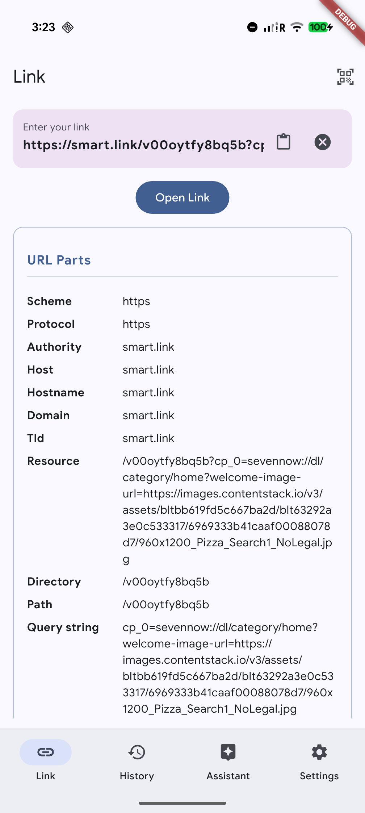
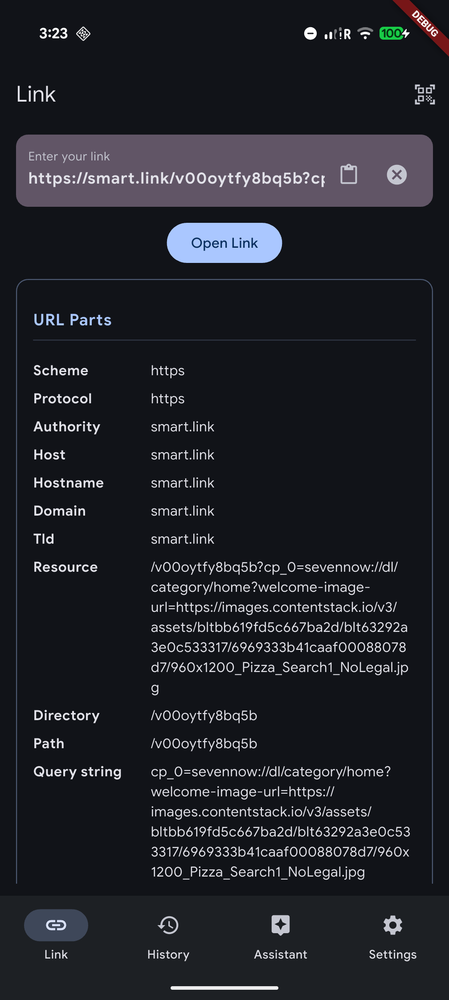
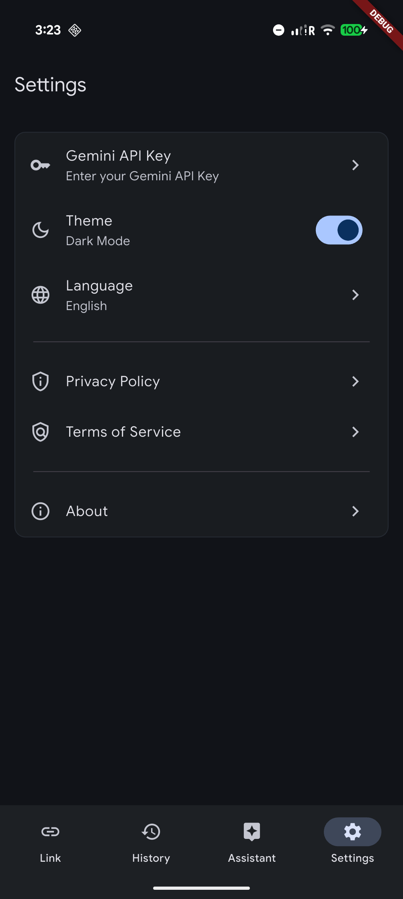
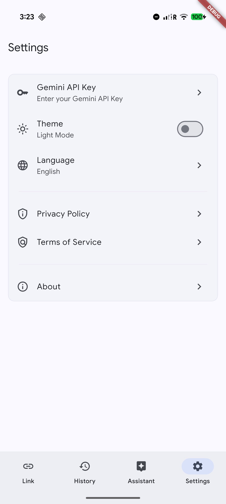

# Smart Link Sentinel

Open source project for testing deeplinks.

<div align="center">


</div>
<div align="center">


</div>

[](https://www.youtube.com/watch?v=Km6JevQ-Xg0)

## Resources
- [🎨 Theme Builder](https://material-foundation.github.io/material-theme-builder/)

## Environment Variables
- `GEMINI_MODEL`: The model to use for the chatbot.
- `YOUR_GEMINI_KEY`: The API key for the model. How to get it? 👉 https://aistudio.google.com/


## Build project

```bash
dart run build_runner build --delete-conflicting-outputs
```

```bash
flutter run --dart-define=GEMINI_MODEL=gemini-3-flash-preview --dart-define=GEMINI_KEY=YOUR_GEMINI_KEY
```

```bash
dart run flutter_launcher_icons
```

## License

This project is licensed under the MIT License - see the LICENSE file for details.

👨‍💻 https://github.com/kzjn10